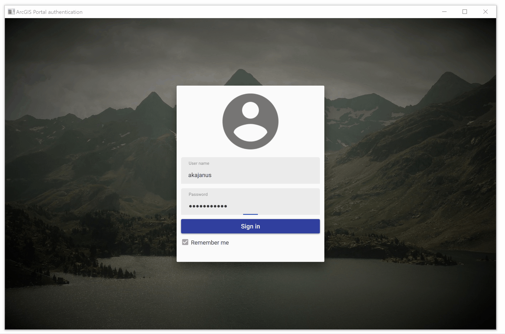

# token-authentication-arcgis-runtime-dotnet
Example implementation how to use token-based authentication using ArcGIS Runtime SDK for .NET.

Read more about the example from [Kajanus.net](https://kajanus.net/2019/04/18/using-token-based-authentication-with-arcgis-runtime/)

# Requirements:

- [ArcGIS Online account](https://developers.arcgis.com/)
- [ArcGIS Runtime SDK for .NET 100.5](https://developers.arcgis.com/net/latest/)
- [Prism](https://github.com/PrismLibrary/Prism)
- [MaterialDesignThemes](https://github.com/MaterialDesignInXAML/MaterialDesignInXamlToolkit)

